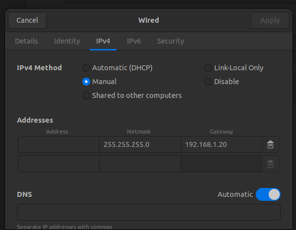

# Connecting to IQR LAN

Follow this guide to set up your wired network connection to IQR Lab's LAN.

1. Connect your computer via Ethernet cable to any open port on the switch
2. Open Settings, find the `Wired` connection, and open its settings.
3. Configure your IPv4 settings as follows:
   
4. Fill in the `Address` field with an available IP address. Ask someone with access to the UniFi controller if you need help finding an available address. Remember the address MUST be in the format `192.168.1.[x]`, where `[x]` $\in [21, 254]$.

   - `[x]` $\in [0, 255]$, however 0 is reserved as the subnet identifier, 255 is reserved for the broadcast address, and $[0, 20]$ is reserved for shared network resources such as the Kinova arm, the network controller, etc.
